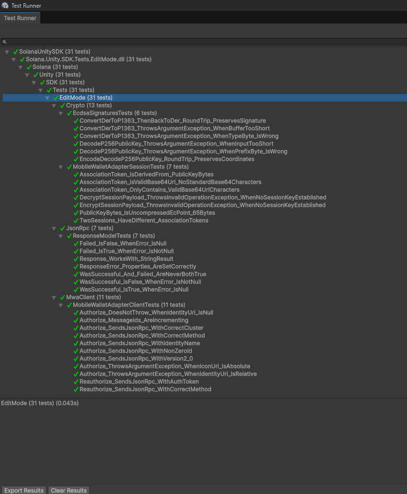
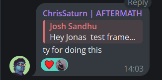
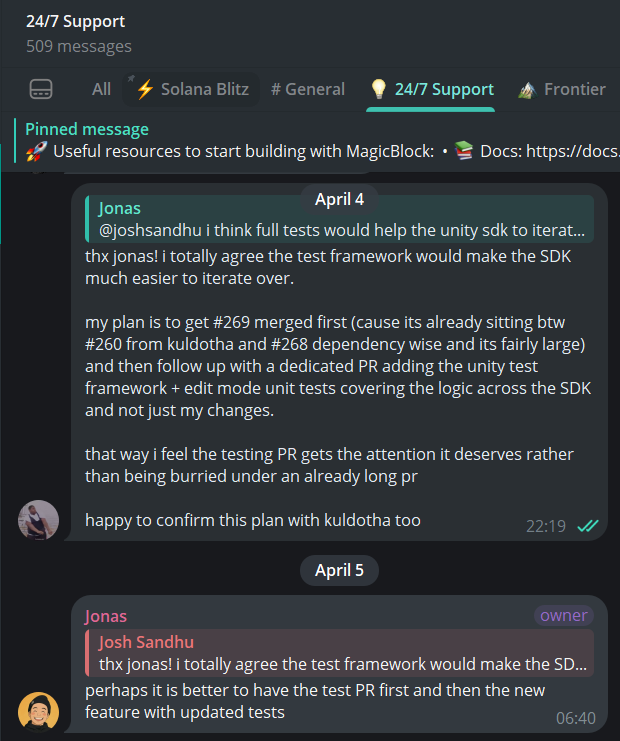
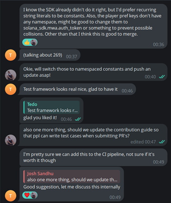
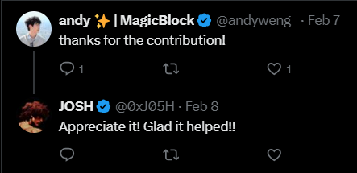

# Unity Mobile Wallet Adapter Parity for Solana Seeker

**Author:** Josh Sandhu  
**GitHub:** https://github.com/JoshhSandhu

**Merged Contributions to Solana.Unity-SDK:**
- [PR #259 - Android Duplicate Class Fix (Merged)](https://github.com/magicblock-labs/Solana.Unity-SDK/pull/259) - solves [#247](https://github.com/magicblock-labs/Solana.Unity-SDK/issues/247) and [#254](https://github.com/magicblock-labs/Solana.Unity-SDK/issues/254)
- [PR #269 - Lifecycle + Session Correctness + React Native Parity (Merged)](https://github.com/magicblock-labs/Solana.Unity-SDK/pull/269) - solves [#267](https://github.com/magicblock-labs/Solana.Unity-SDK/issues/267)
- [PR #276 - Unity Test Framework Infrastructure (Merged)](https://github.com/magicblock-labs/Solana.Unity-SDK/pull/276)
- [PR #283 - MWA Lifecycle EditMode Regression Tests (Merged)](https://github.com/magicblock-labs/Solana.Unity-SDK/pull/283)
- [PR #284 - Injectable MWA Auth Cache + Wallet Package Targeting (Merged)](https://github.com/magicblock-labs/Solana.Unity-SDK/pull/284) - solves [#271](https://github.com/magicblock-labs/Solana.Unity-SDK/issues/271) and [#272](https://github.com/magicblock-labs/Solana.Unity-SDK/issues/272)

**Reference Example Application:**
- [CrossyRoad - Seeker Example App](https://github.com/JoshhSandhu/CrossyRoad)

## Executive Summary

This proposal requests **$10,000 USD equivalent in SKR** to complete and ship the remaining Unity Mobile Wallet Adapter parity surface required for production-quality Solana Seeker game development.

Five upstream PRs have already merged, covering Android build stability, lifecycle correctness, regression testing, auth cache abstraction, and wallet package targeting. Remaining grant scope is documentation parity and transaction submission ergonomics.

This work builds on five merged upstream contributions to the Solana.Unity-SDK, alongside a Seeker-validated Unity example application and follow-up parity work spanning authorization caching, wallet package targeting, documentation alignment, transaction submission ergonomics, and expanded lifecycle regression coverage in coordination with SDK maintainers.

These changes were validated directly inside gameplay loops running on Solana Seeker hardware.

The goal is not a single feature contribution. It is ownership of the Unity Mobile Wallet Adapter lifecycle and parity surface so Unity developers can build against Solana Mobile with the same confidence and developer experience already available in the React Native SDK.

## Alignment With Solana Seeker Ecosystem Adoption

This work enables Unity developers to deploy production-quality mobile gameplay experiences directly targeting Solana Seeker hardware.

The CrossyRoad Seeker integration demonstrates end-to-end Mobile Wallet Adapter lifecycle correctness inside a production-style Unity gameplay loop running directly on Solana Seeker hardware, reducing uncertainty for developers adopting Solana Mobile wallet flows inside Unity projects.

By closing SDK parity, lifecycle coverage, regression testing, and documentation gaps, this work makes Solana Seeker significantly more accessible to Unity game developers who would otherwise need to implement and maintain custom Mobile Wallet Adapter session-management infrastructure themselves.

## Alignment With Unity MWA Parity RFP

This proposal directly addresses the Unity Mobile Wallet Adapter parity RFP requirements by:

- fixing session lifecycle correctness
- exposing wallet capability negotiation
- implementing reconnect and deauthorize flows
- introducing regression test infrastructure for SDK stability
- delivering wallet package targeting for reliable reconnect, sign, and disconnect on Android
- delivering documentation parity with the React Native SDK
- validating integration inside a production-style Unity gameplay loop on Solana Seeker hardware

The scope is focused on parity completion and production readiness rather than speculative feature work.

## Ecosystem Problem Statement

Unity developers targeting Solana Mobile currently lack lifecycle-complete Mobile Wallet Adapter support compared to the React Native SDK. This creates integration friction, increases boilerplate requirements, and makes production-quality gameplay flows harder to ship reliably on Solana Seeker hardware.

Prior to the recent lifecycle correctness and testing infrastructure improvements merged into the Solana.Unity-SDK, key limitations included:

- `Logout()` clearing local state without revoking the wallet authorization session
- missing `ReconnectWallet()` support for silent session restoration after app restart
- missing `DisconnectWallet()` support for clean session teardown with de-auth
- no `GetCapabilities()` exposure for Mobile Wallet Adapter 2.0 feature negotiation
- no extensible authorization token cache abstraction for secure persistence
- no reliable wallet package targeting for reconnect, sign, and disconnect flows after first connect
- `keepConnectionAlive` restoring cached account state without verifying token validity
- no automated lifecycle regression testing infrastructure
- no Unity lifecycle documentation aligned with the React Native SDK parity surface

These gaps were not theoretical. They surfaced directly while integrating Mobile Wallet Adapter flows into the SolRacer gameplay loop during Frontier Hackathon development, and were independently confirmed by another Unity developer in [issue #273](https://github.com/magicblock-labs/Solana.Unity-SDK/issues/273), who reported needing custom workarounds to ship their own Mobile Wallet Adapter integration.

## Contributions Delivered So Far

### PR #259 - Android Duplicate Class Fix (Merged)

[PR #259](https://github.com/magicblock-labs/Solana.Unity-SDK/pull/259) fixed a real Android build failure in the Solana Unity SDK caused by overlapping AndroidX and Guava artifacts being included both as packaged plugin files and as Gradle-resolved dependencies. In affected projects, Gradle reported duplicate classes such as `android.support.v4.app.RemoteActionCompatParcelizer` and `com.google.guava.listenablefuture`, which stopped Android compilation before an APK or AAB could be produced.

This mattered for Unity mobile developers because the failure reproduced in fresh projects immediately after importing the SDK, blocking normal Android build and run workflows and forcing manual library cleanup as a workaround.

It also mattered for Solana Seeker targeting, since Seeker validation depends on successful Android device builds to test Mobile Wallet Adapter and Seed Vault flows on real hardware.

The merged upstream fix removed that adoption blocker by moving dependency handling back under Gradle control, and it established contributor trust with maintainers by landing a nontrivial Android build-system fix through review.

- technical change made: removed conflicting packaged AndroidX and Guava artifacts and added `AndroidGradleAutoConfig` to patch `mainTemplate.gradle` with compatible dependency resolution rules
- issues resolved: fixes the duplicate-class Android build failure in [#247](https://github.com/magicblock-labs/Solana.Unity-SDK/issues/247) and the same import-to-build Android blocker reported again in [#254](https://github.com/magicblock-labs/Solana.Unity-SDK/issues/254)
- ecosystem impact: restored a working Android build path for Unity teams evaluating Solana mobile integrations, including Solana Seeker device testing

### PR #269 - Lifecycle + Session Correctness + React Native Parity

[PR #269](https://github.com/magicblock-labs/Solana.Unity-SDK/pull/269) addresses [issue #267](https://github.com/magicblock-labs/Solana.Unity-SDK/issues/267), a real Mobile Wallet Adapter lifecycle bug where `keepConnectionAlive` could restore cached `Account` state from `PlayerPrefs["pk"]` without restoring a valid `authToken`-backed authorization session.

`keepConnectionAlive` is supposed to make process restarts safe for mobile apps: if a cached session is still valid, login should silently reauthorize and return the game to a usable connected state; if it is no longer valid, the SDK should clear stale state and surface a fresh `Authorize()` prompt during reconnect.

Before this fix, the adapter could come back after app restart looking connected while lacking a valid auth session, so the first `SignTransaction()` or `SignMessage()` call triggered a full wallet approval flow in the middle of gameplay instead of during login.

For gameplay integrations, that is not a cosmetic reconnect issue. It is a session-correctness failure that breaks the expected game loop. On Solana Seeker, where real gameplay flows depend on Mobile Wallet Adapter and Seed Vault-backed wallet approvals on device, stale session restoration creates ambiguous player state, interrupts actions such as signing match results or reward claims, and makes explicit logout or account switching unreliable after process death.

PR #269 fixes that by coupling cached account restoration to cached authorization restoration and by clearing both local and wallet-side session state when the player intentionally disconnects.

This work also moves the Unity SDK into parity with the core lifecycle expectations mobile teams already rely on in React Native integrations: reconnect flows should route through `reauthorize`, logout should support explicit wallet-side `deauthorize`, capabilities should be queryable through `get_capabilities`, and apps should have explicit reconnect and disconnect surfaces plus lifecycle events.

In that sense, [PR #269](https://github.com/magicblock-labs/Solana.Unity-SDK/pull/269) is not just a bug fix; it restores the lifecycle correctness required for production mobile gameplay integrations on Solana Seeker and other Android MWA targets.

**Changes implemented in the PR:**

| Feature | Status |
|---|---|
| `DisconnectWallet()`: deauthorizes the wallet-side session before clearing local state | Done |
| `ReconnectWallet()`: re-enters through the cached-token `reauthorize` path and fires reconnect events on success | Done |
| `GetCapabilities()`: exposes the MWA 2.0 capabilities RPC for wallet feature and limit negotiation | Done |
| `Deauthorize()` added to `IAdapterOperations` and `MobileWalletAdapterClient` | Done |
| `OnWalletDisconnected` and `OnWalletReconnected` events | Done |
| `keepConnectionAlive` fix: requires successful reauthorization before restoring cached session state | Done |

- reconnect correctness after process restart: cached account restore now succeeds only when cached authorization is also restored through `Reauthorize()`, otherwise stale state is cleared and login falls back to a fresh `Authorize()` flow
- logout correctness requiring fresh Seed Vault approval: `DisconnectWallet()` uses `Deauthorize()` before local cleanup so a post-logout relaunch requires new wallet approval instead of silently reviving stale authorization
- capability negotiation availability: `GetCapabilities()` exposes wallet limits, supported transaction versions, and clone-authorization support needed for MWA 2.0 parity
- explicit wallet-side deauthorization support: Unity now exposes the full `authorize` / `reauthorize` / `deauthorize` lifecycle surface, with `DisconnectWallet()` + `ReconnectWallet()` completing the app facing control path

All changes were validated on Solana Seeker hardware inside a gameplay loop. That validation mattered because the bug reproduced as a real process-restart desynchronization on device, and the fix needed to prove both silent reconnect correctness and explicit logout correctness under actual gameplay conditions.

A screen recording demonstrating the flows is attached to PR #269.

Screen Recording can also be viewed here:

https://youtube.com/shorts/d_3qBRdb2BU?feature=share

### PR #276 - Unity Test Framework Infrastructure

[PR #276](https://github.com/magicblock-labs/Solana.Unity-SDK/pull/276) introduces the first automated Unity Test Framework foundation for the SDK. This work was added after MagicBlock DevRel asked about automated test coverage during lifecycle work discussion in the MagicBlock Builders channel, highlighting the absence of a regression harness in the SDK and motivating the addition of PR #276.

**What the PR adds:**

- `Tests/EditMode/EditMode.asmdef` for Unity Test Framework support
- 31 EditMode unit tests across 4 test classes
- `MockMessageSender` as a reusable test double for `IMessageSender`
- regression coverage for request building, session payload handling, response model behavior, and signature utilities

**Current coverage includes:**

- `EcdsaSignaturesTests` - DER and P1363 round-trip behavior, malformed input guards, and public key encode and decode coverage
- `MobileWalletAdapterSessionTests` - AssociationToken Base64Url validity and encrypt-before-ECDH guard coverage
- `MobileWalletAdapterClientTests` - Authorize and Reauthorize JSON-RPC request building plus input validation
- `ResponseModelTests` - `WasSuccessful` and `Failed` computed property correctness

**Additional value already produced:**

- uncovered a pre-existing logging bug in `DecryptSessionPayload`, which reported "Cannot encrypt" instead of "Cannot decrypt"
- established a regression harness so future lifecycle and parity work can land more safely

All 31 tests are passing in the Unity Test Runner in EditMode.

**Unity Test Framework validation screenshot:**

### PR #283 - MWA Lifecycle EditMode Regression Tests (Merged)

[PR #283](https://github.com/magicblock-labs/Solana.Unity-SDK/pull/283) is a tooling follow-up to [PR #276](https://github.com/magicblock-labs/Solana.Unity-SDK/pull/276) and the lifecycle work merged in [PR #269](https://github.com/magicblock-labs/Solana.Unity-SDK/pull/269). It adds automated EditMode coverage for the Mobile Wallet Adapter lifecycle surface that was previously validated manually on device.

This PR is tooling-only and does not modify runtime SDK behavior. Its value is regression protection for the parity work already delivered: `Deauthorize`, `GetCapabilities`, `keepConnectionAlive` auth-token restoration, and the legacy-to-namespaced PlayerPrefs migration introduced around the PR #269 lifecycle fixes.

**Test coverage added:**

- `CapabilitiesResultTests` for MWA capability response JSON mapping, nullable fields, unknown-field tolerance, and `Response<T>` envelope behavior
- `MobileWalletAdapterClientLifecycleTests` for exact JSON-RPC request shape, method names, params, request ID sequencing, and return types for `deauthorize` and `get_capabilities`
- `IAdapterOperationsContractTests` for reflection-based interface contract checks, including `[Preserve]` coverage and the expected six-method adapter surface
- `SolanaMobileWalletAdapterPrefsTests` for namespaced PlayerPrefs keys, legacy `pk` / `authToken` migration behavior, idempotence, and half-migrated install cases

The PR adds 44 new EditMode tests across 4 test classes, bringing the visible Unity Test Runner total from the earlier baseline to 78 passing EditMode tests. This strengthens the regression-safety story by showing that lifecycle parity work is backed by automated tests rather than remaining dependent only on manual Seeker device validation.

### PR #284 - Injectable MWA Auth Cache + Wallet Package Targeting (Merged)

[PR #284](https://github.com/magicblock-labs/Solana.Unity-SDK/pull/284) addresses duplicate tracker issues [#271](https://github.com/magicblock-labs/Solana.Unity-SDK/issues/271) and [#272](https://github.com/magicblock-labs/Solana.Unity-SDK/issues/272), and completes the wallet package targeting work required for reliable reconnect, sign, and disconnect flows on Android.

**Auth cache abstraction (`IMwaAuthCache`):**

- introduces a narrow `IMwaAuthCache` interface with `Get`, `Set`, and `Clear` methods for auth-token persistence
- ships a default `PlayerPrefsAuthCache` implementation that preserves the post-PR #269 storage key and default behavior for existing projects
- moves the SDK from hardcoded plaintext `PlayerPrefs` token storage toward an injectable persistence layer
- keeps the public API backward compatible by adding the auth cache as an optional constructor parameter on the wallet adapters
- adds EditMode coverage for round-trip storage, clear behavior, null and empty token handling, scoped-key isolation, backward compatibility with the PR #269 key, and constructor injection guards

**Wallet package targeting (chooser capture):**

After first connect, the SDK must know the real Android package name of the wallet the user selected so later MWA calls can use `intent.setPackage()` instead of reopening the OS wallet chooser or targeting the wrong app. Prior heuristics based on account labels, auth-token metadata, and hardcoded package dictionaries failed on real devices and could cause silent `ActivityNotFoundException` failures during disconnect.

PR #284 fixes this by capturing the wallet package through the Android system chooser:

- `MwaChooserHelper.java` launches `Intent.createChooser()` with a `PendingIntent` callback and reads `Intent.EXTRA_CHOSEN_COMPONENT` to obtain the selected wallet package
- `MwaNativeChooser.cs` provides the C# JNI bridge into the Java helper
- `IMwaWalletSelectionCache` and `PlayerPrefsMwaWalletSelectionCache` persist the chosen package across sessions
- `MwaWalletDiscovery` reads the cache and falls back to the OS chooser when no package is stored
- `LocalAssociationScenario` launches the chooser on untargeted first connect and uses the cached package on subsequent associations

This approach requires no SDK manifest entry for the chooser path and removes fragile label or auth-token package guessing entirely.

**Additional hardening shipped in the same PR:**

- association flow cancellation and timeout handling in `LocalAssociationScenario`
- per-launch nonce validation on chooser broadcast callbacks for API below 33
- WebGL wallet event payload memory leak fix (`_free` after emit)
- `SessionWallet` guard against null `Web3.Wallet` / `ActiveRpcClient` before factory use

**Device validation (CrossyRoad on Solana Seeker):**

| Wallet | Package captured | Targeted disconnect |
|---|---|---|
| Mock wallet | `com.solana.mwallet` | Verified |
| Phantom | `app.phantom` | Verified |
| Solflare | `com.solflare.mobile` | Verified |
| Jupiter | `ag.jup.jupiter.android` | Verified |

Cache persistence across app restart was also verified. Maintainer Tedo tested the branch on device before merge.

### CrossyRoad Seeker Example App (Gameplay Validation)

**Repository:** [CrossyRoad](https://github.com/JoshhSandhu/CrossyRoad)

CrossyRoad is an open-source Unity Android gameplay example that serves as a real-device validation environment for Mobile Wallet Adapter lifecycle flows on Solana Seeker.

**Validated scenarios:**

| Scenario | Result |
|---|---|
| Connect -> kill app -> reopen | Silent reconnect with no popup |
| Connect -> logout -> kill app -> reopen | Fresh wallet approval required |
| Logout clears both Privy and Seeker sessions correctly | Verified |
| `GetCapabilities()` called after connect and result logged | Verified |
| `OnWalletDisconnected` and `OnWalletReconnected` events fire | Verified |
| First connect captures wallet package via OS chooser | Verified |
| Reconnect/disconnect/sign target cached wallet without chooser sheet | Verified |

This example gives Unity developers a working gameplay reference they can inspect, fork, and adapt for their own Solana Mobile flows.

### Gameplay Loop Integration Architecture

CrossyRoad validates wallet lifecycle behavior inside the same flow that gates entry into play.

Initial Seeker connection is triggered from the start-screen auth flow via `AuthenticationFlowManager.ConnectWallet()`, which calls `LoginWalletAdapter()`, persists the Seeker login method, marks the session active, and advances the player into the welcome screen that unlocks gameplay start.

`keepConnectionAlive` is enabled in the gameplay app's Solana wallet controller configuration so the SDK can retain cached MWA session metadata across process death and relaunch.

On restart, `AuthenticationFlowManager.StartAuthenticationFlow()` checks the persisted login method before showing UI and attempts silent recovery first rather than forcing the player back through wallet approval.

Silent restoration is validated through `TryReconnectMwaWalletWithResult()`, which calls `LoginWalletAdapter()` on cold start to reauthorize from cached `authToken` and `pk` without showing a popup when the token is still valid. After the welcome panel is shown, `TryReconnectMwaWallet()` also exercises `ReconnectWallet()` on the live adapter instance to restore an already-authorized session without interrupting the gameplay entry path.

Fresh approval is validated through the logout path.

`AuthenticationFlowManager.Logout()` calls `DisconnectMwaWallet()`, which invokes the SDK disconnect flow; in the lifecycle fix set this executes walletside `Deauthorize()` before local state is cleared. Combined with clearing the stored login method, this ensures the next launch cannot silently reuse the prior session and must request fresh Seed Vault approval.

`GetCapabilities()` is called in `SeekerWalletManager.ConnectToSeekerWallet()` immediately after successful MWA connection. This matters because the example validates real device capabilities such as transaction/message request limits and clone-authorization support before treating the wallet as productionready for gameplay-linked actions.

Wallet lifecycle events are propagated back into gameplay state instead of remaining isolated inside a wallet demo scene.

`SeekerWalletManager` subscribes to `OnWalletDisconnected` and `OnWalletReconnected`, updates shared `WalletSessionState`, and surfaces player-facing reconnect/disconnect toasts.

`AuthenticationFlowManager` also emits `OnAuthenticationStateChanged`, which gameplay UI such as `ShopManager` consumes to refresh wallet-gated state. Validating these flows inside the gameplay loop is stronger than validating them in a wallet-only sample because start-screen progression, balance checks, transfer UI, and session resume behavior all depend on correct lifecycle handling under real player navigation.

### Why CrossyRoad Serves as a Production-Style Validation Environment

Testing inside CrossyRoad is materially different from SDK-only validation because wallet state is not observed in isolation; it directly controls whether the player can resume, enter the game, access wallet-linked UI, and continue through connected gameplay flows after restart. This exposes regressions that a standalone wallet scene can miss, especially around timing, UI state transitions, and reconnect behavior under actual scene flow.

Validation was performed on Solana Seeker hardware using real Mobile Wallet Adapter and Seed Vault authorization flows, including first approval, silent reconnect after relaunch, and forced reapproval after explicit logout. That is the relevant operational path for Solana mobile games, not a simulator-only or editoronly approximation.

Lifecycle correctness matters for mobile game UX because stale sessions, unnecessary approval prompts, or incomplete logout behavior translate directly into broken resume flows, blocked play entry, and inconsistent wallet-dependent UI after the app is backgrounded, killed, or reopened. In a gameplay context, these are user-facing failures, not just SDK edge cases.

Publishing these patterns inside a working Unity gameplay example reduces integration risk for other developers. It gives teams a concrete reference for where to trigger connection, how to preserve and invalidate session state, how to handle reconnect and disconnect events, and how to verify MWA behavior on actual Solana mobile hardware before shipping their own game loops.

---

## Contributions In Progress

### Documentation parity with React Native SDK

Unity lifecycle documentation will be added to `solana-mobile/solana-mobile-doc-site-v2`, mirroring the React Native Mobile Wallet Adapter documentation structure.

Planned page: `get-started/unity/mobile-wallet-adapter-lifecycle.mdx`

Planned documentation coverage:

- `keepConnectionAlive` behavior and expected lifecycle semantics
- auth token caching, persistence, and restoration
- wallet package capture via OS chooser and targeted reconnect/disconnect flows
- `DisconnectWallet()` with deauthorize flow
- `ReconnectWallet()` silent reconnect flow
- `GetCapabilities()` usage
- `OnWalletDisconnected` and `OnWalletReconnected` event handling
- complete C# examples for each lifecycle path

This documentation work is intended to land with placement coordination through the Solana Mobile docs team.

## Planned Contributions (Parity Completion Roadmap)

### SignAndSendTransaction parity improvements (#189)

The SDK still lacks more ergonomic transaction submission helpers aligned with React Native SDK behavior.

Follow-on work based on [issue #189](https://github.com/magicblock-labs/Solana.Unity-SDK/issues/189) will improve parity for gameplay transaction flows.

Planned improvements include:

- exposing `SignAndSendTransaction` flow parity
- reducing boilerplate for gameplay transaction submission
- improving reliability for mobile gameplay UX
- validating transaction submission inside the example app

## Community Validation

The need for Unity Mobile Wallet Adapter lifecycle and parity improvements has already been validated through direct feedback from ecosystem contributors and SDK maintainers.

- [Issue #273](https://github.com/magicblock-labs/Solana.Unity-SDK/issues/273) independently documented the same lifecycle and parity gaps encountered during gameplay integration, confirming that these limitations affected multiple Unity developers building against Solana Mobile Wallet Adapter.
- Chris from the Solana ecosystem acknowledged the Unity regression testing infrastructure introduced in PR #276 as a meaningful improvement to SDK stability and long-term maintainability for Mobile Wallet Adapter integrations inside Unity environments, reinforcing the need for structured lifecycle testing support within the Solana.Unity-SDK.

  

- Jonas from MagicBlock requested the addition of Unity regression test infrastructure inside the MagicBlock Builders Telegram channel, which directly informed the implementation delivered in PR #276.

  

- Solana.Unity-SDK maintainer Kuldotha reviewed and positively acknowledged the lifecycle correctness fixes and supporting infrastructure contributions, confirming alignment with SDK stability priorities and production readiness goals.

  

- Andy from MagicBlock publicly acknowledged the upstream Android duplicate-class fix delivered in PR #259, which resolved a Unity 6 + Android build issue blocking Solana Mobile Wallet Adapter integration and improved SDK usability for developers targeting Solana Seeker hardware.

  

Together, this feedback demonstrates that the proposed work is not speculative parity exploration. It reflects active ecosystem demand and maintainer-aligned improvements already moving the Unity Mobile Wallet Adapter toward production readiness on Solana Seeker hardware.

## Ecosystem Impact

These contributions enable:

- Unity developers to build production-quality MWA integrations on Solana Seeker without writing custom lifecycle boilerplate
- reliable wallet package targeting after first connect, eliminating repeated OS chooser sheets and silent wrong-package failures on disconnect
- parity with React Native SDK behavior for reconnect, disconnect, deauthorize, and capabilities flows
- regression-safe SDK evolution through automated test infrastructure
- faster onboarding through documentation parity and example code
- a working gameplay reference app that developers can study and fork

Because Unity remains a major entry point for mobile game development, improving this SDK materially expands the builder surface for Solana Mobile.

## Why This Work Is Necessary Now

Solana Seeker introduces a dedicated mobile-first developer surface, and Unity represents a major share of the mobile game development ecosystem.

Completing Mobile Wallet Adapter lifecycle parity now allows Unity to become a first-class entry point into the Solana Mobile ecosystem while Seeker adoption patterns are still being formed.

Without these lifecycle fixes, documentation improvements, and regression safeguards, developers must implement custom session restoration, deauthorization, and transaction flow logic themselves. That slows shipping, increases support burden, and raises the risk of broken mobile wallet experiences.

## About Me

I am a professional Unity game developer with over 4+ years of production experience building real-money and mobile gameplay systems, including development of 8+ shipped slot-style game titles in commercial environments. My work has focused on gameplay architecture, runtime reliability, platform integration, and shipping production-ready Unity experiences under strict release timelines.

More recently, I have been building Solana-native gameplay integrations targeting mobile environments, including Solana Seeker hardware. During Frontier Hackathon development of SolRacer, I encountered Mobile Wallet Adapter lifecycle limitations firsthand while integrating wallet connectivity directly into a gameplay loop. These integration constraints motivated the lifecycle correctness and parity improvements implemented in PR #269.

I am an active contributor to the Solana.Unity-SDK and have already delivered five merged infrastructure improvements:

- PR #259: Android duplicate-class Gradle fix (merged)
- PR #269: Mobile Wallet Adapter lifecycle + session correctness + React Native parity improvements (merged)
- PR #276: Unity Test Framework regression infrastructure for lifecycle stability (merged)
- PR #283: MWA lifecycle EditMode regression tests (merged)
- PR #284: Injectable MWA auth cache + wallet package targeting via Android chooser capture (merged)

In addition to SDK contributions, I maintain CrossyRoad as a reference Unity gameplay integration demonstrating correct Mobile Wallet Adapter lifecycle behaviour validated directly on Solana Seeker hardware.

My goal through this work is to make Unity a reliable and production-ready entry point for developers building gameplay experiences on Solana Mobile by completing the lifecycle and parity surface required for stable Mobile Wallet Adapter integrations.

## Deliverables

| Deliverable | Status | Outcome |
|---|---|---|
| PR #259: Android duplicate fix | Delivered | fixes [#247](https://github.com/magicblock-labs/Solana.Unity-SDK/issues/247) and [#254](https://github.com/magicblock-labs/Solana.Unity-SDK/issues/254) |
| PR #269: lifecycle + session correctness + RN parity | Delivered | reconnect, disconnect, deauthorize, capabilities, event, and stale-session fixes |
| PR #276: Unity Test Framework infra | Delivered | baseline regression harness with 31 EditMode tests |
| PR #283: MWA lifecycle EditMode regression tests | Delivered | 44 additional EditMode tests; 78 total passing |
| PR #284: auth cache + wallet package targeting | Delivered | `IMwaAuthCache`, `IMwaWalletSelectionCache`, chooser capture via `EXTRA_CHOSEN_COMPONENT`; fixes [#271](https://github.com/magicblock-labs/Solana.Unity-SDK/issues/271) and [#272](https://github.com/magicblock-labs/Solana.Unity-SDK/issues/272) |
| CrossyRoad Seeker example integration | Delivered | real gameplay validation on Solana Seeker hardware |
| Documentation parity with RN SDK | Planned | Unity lifecycle docs and copyable C# examples |
| `SignAndSendTransaction` parity improvements ([#189](https://github.com/magicblock-labs/Solana.Unity-SDK/issues/189)) | Planned | lower-boilerplate transaction submission for mobile gameplay |

## Execution Timeline

### Phase 1 Completed Infrastructure Delivery

Delivered:

- PR #259 (Android duplicate-class fix)
- PR #269 (lifecycle + session correctness + React Native parity improvements)
- PR #276 (Unity Test Framework regression infrastructure)
- PR #283 (MWA lifecycle EditMode regression tests)
- PR #284 (injectable MWA auth cache + wallet package targeting)

These have already been merged into the Solana.Unity-SDK, establishing the lifecycle-correct and wallet-targeting baseline required for Mobile Wallet Adapter parity work.

### Phase 2 Documentation Parity with React Native SDK

Estimated timeline: 3 days

Deliver lifecycle-complete Unity documentation aligned with the React Native Mobile Wallet Adapter SDK, including copyable C# integration examples and gameplay-loop usage guidance validated on Solana Seeker hardware.

### Phase 3 Transaction Submission Ergonomics (`SignAndSendTransaction` parity)

Estimated timeline: 5 days

Improve `SignAndSendTransaction` parity surface ([#189](https://github.com/magicblock-labs/Solana.Unity-SDK/issues/189)) to reduce boilerplate for gameplay-triggered mobile transaction submission inside Unity environments.

Overall expected execution window: approximately 1-2 weeks for remaining deliverables, subject primarily to maintainer review cadence for follow-on PR merges.

## Requested Grant Amount

**$10,000 USD equivalent in SKR**

| Deliverable | Value |
|---|---|
| PR #269: lifecycle parity implementation | $3,000 |
| PR #276: Unity Test Framework regression infrastructure (31 EditMode tests) | $1,500 |
| PR #283: MWA lifecycle EditMode regression tests (+44 tests, 78 total) | $500 |
| CrossyRoad Seeker example integration | $1,500 |
| `IMwaAuthCache` + wallet package targeting ([#271](https://github.com/magicblock-labs/Solana.Unity-SDK/issues/271), PR #284) | $1,000 |
| transaction submission parity work ([#189](https://github.com/magicblock-labs/Solana.Unity-SDK/issues/189)) | $1,000 |
| PR #259: Android duplicate class fix | $1,000 |
| documentation parity with React Native SDK | $500 |

## References

- [PR #259 - Android Duplicate Class Fix](https://github.com/magicblock-labs/Solana.Unity-SDK/pull/259)
- [PR #269 - Lifecycle + Session Correctness + React Native Parity](https://github.com/magicblock-labs/Solana.Unity-SDK/pull/269)
- [PR #276 - Unity Test Framework Infrastructure](https://github.com/magicblock-labs/Solana.Unity-SDK/pull/276)
- [PR #283 - MWA Lifecycle EditMode Regression Tests](https://github.com/magicblock-labs/Solana.Unity-SDK/pull/283)
- [PR #284 - Injectable MWA Auth Token Cache Abstraction](https://github.com/magicblock-labs/Solana.Unity-SDK/pull/284)
- [Issue #189 - SignAndSendTransaction parity follow-on](https://github.com/magicblock-labs/Solana.Unity-SDK/issues/189)
- [Issue #267 - keepConnectionAlive bug](https://github.com/magicblock-labs/Solana.Unity-SDK/issues/267)
- [Issue #271 - IMwaAuthCache tracking](https://github.com/magicblock-labs/Solana.Unity-SDK/issues/271)
- [Issue #272 - IMwaAuthCache duplicate tracking issue](https://github.com/magicblock-labs/Solana.Unity-SDK/issues/272)
- [CrossyRoad Example App](https://github.com/JoshhSandhu/CrossyRoad)
- [Solana Unity SDK Repository](https://github.com/magicblock-labs/Solana.Unity-SDK)
